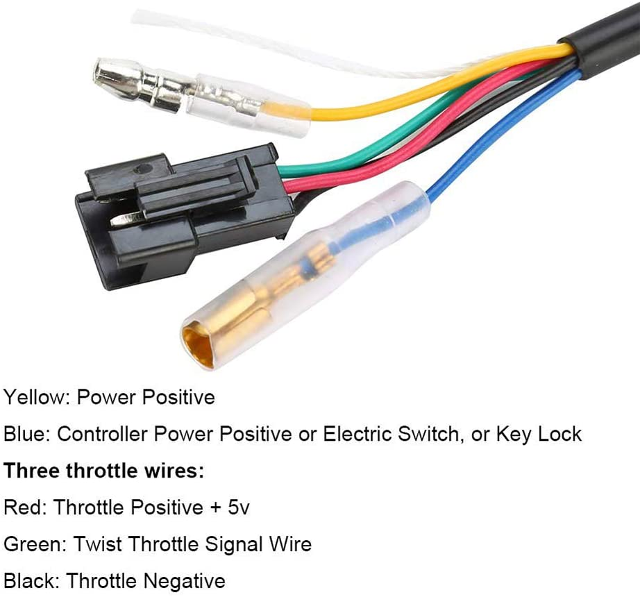

## Speed Control

Involves design of mechanisms to allow for control of the speed of the motor.
Schematics and final designs handled here.

## Design
In this implementation we will control the brushless motor using Arduino and ESC.

## Components

Brushless Motor  
ESC 30A  
Li-Po battery  
Arduino Board  
Potentiometer  
Breadboard and Jump Wires 

## Schematic

# Alternative solution
This involves the use of a ready made Handlebar Throttle Switch to allow for the control of speed.

## Reasons for choosing this solution
Pairs well with the motor controller being used.( A plug and play solution).  
Has inbuilt LED speed display eliminating the need of an external LCD display.  
Does not involve the use of a microcontroller thus saving costs.

## Images of the Handlebar Throttle Switch

